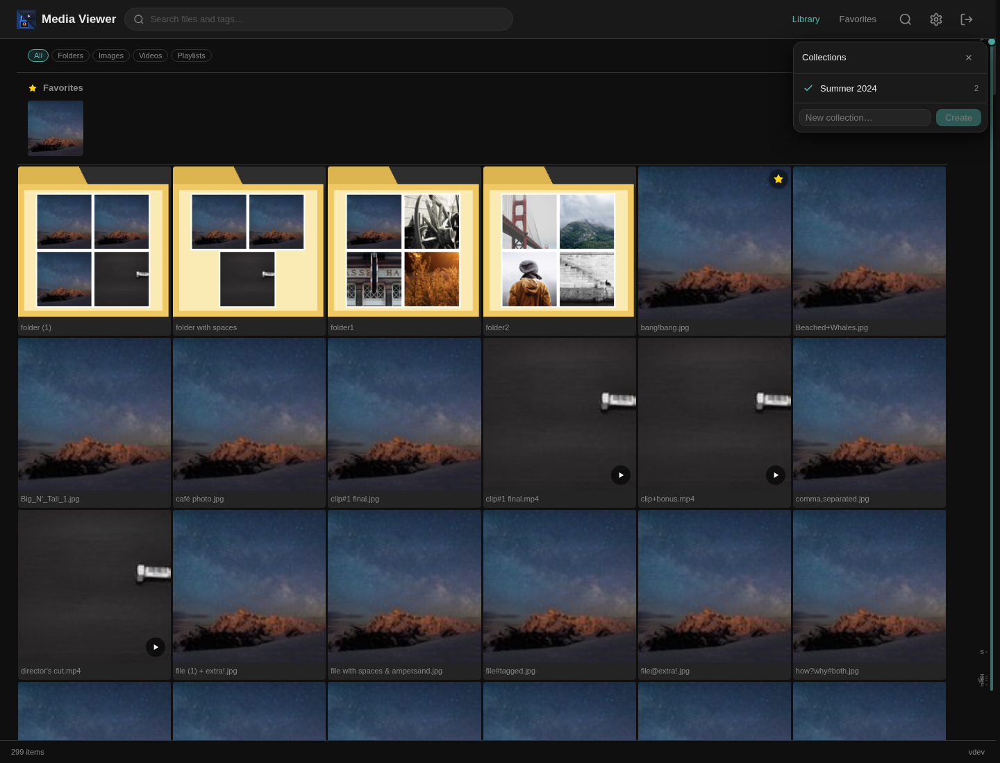
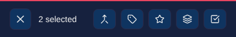
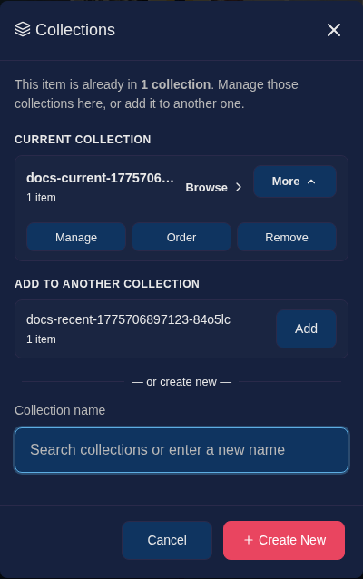
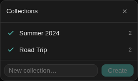
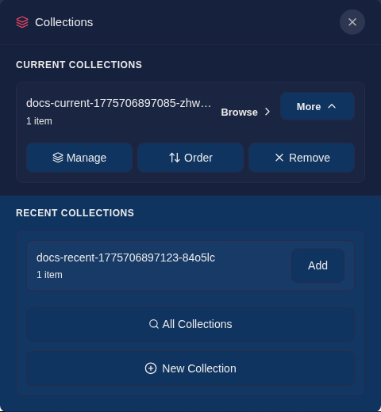

# Collections

Collections let you save your own named groups of images and videos so you can come back to them later, browse them in order, and keep related items together without moving files on disk.

	<video autoplay loop muted playsinline width="700">
		<source src="../../images/collections-workflow.mp4" type="video/mp4">
		
	</video>
	
<em>Collections support quick filtering, secondary actions, and repeat curation workflows from a single panel.</em>

## What Collections Are

- Collections are custom groups that you create yourself.
- They work well for shortlists, albums, review sets, moodboards, trip planning, or any other hand-picked set of media.
- A collection belongs to a single folder. You cannot mix items from different folders into the same collection.
- Collections can be empty when you first create them, which is useful if you want to plan or curate a set before filling it.

## Where You Use Them

You can work with collections from several places in the app:

- On desktop, hover a gallery item to reveal the collect button for quick single-item actions.
- On touch devices, long-press to enter selection mode and use **Collect** in the bottom toolbar when you want to curate from the gallery.
- From a collected item, the collections modal shows the collections that already contain that item first.
- From the header, open **Collections** to browse and manage all collections for the current area of your library.
- From the lightbox, use the collections drawer for quick actions without leaving full-screen viewing.

These entry points are designed to stay consistent: browse is the primary action, while management actions such as reorder or remove stay grouped behind secondary controls.

	
	
<em>On touch devices, collections move into the selection toolbar so gallery cards can stay focused on tap, double-tap, and long-press gestures.</em>

## Touch Workflow

On touch devices, collections follow the same selection-first pattern as other bulk actions:

1. **Tap** opens an item
2. **Double-tap** toggles favorite
3. **Long-press** enters selection mode
4. Use **Collect** in the selection toolbar for gallery-based curation, or use the lightbox drawer for single-item work

## Creating Collections

You can create a collection in two common ways:

1. Select one or more images or videos and create a collection from that selection.
2. Open the collections manager and create an empty collection first, then add items over time.

For gallery-based curation, that usually means:

- **Desktop**: hover a card and use the inline collect button, or select several items first
- **Touch**: long-press into selection mode, then tap **Collect** in the bottom toolbar

When you type a collection name, Media Viewer checks whether that name is already in use. If the same name already exists where it would conflict, you will see that before saving.

## Adding Items

When you add an item to collections, Media Viewer separates the experience into clear sections:

- **Current collections** show where the item already belongs.
- **Recent collections** help you quickly add the item to collections you have used recently.
- **Create new** lets you start a new collection from the same modal.

If an item is already in a collection, you can browse that collection directly, reorder it, or remove the item from it.

	
	
<em>The item-level collections modal keeps current memberships first, then surfaces recent collections for quick repeat actions.</em>

## Browsing and Reordering

Opening a collection switches the gallery into that collection's ordered view. This is useful when the order matters, such as for a shortlist or a presentation flow.

You can then:

- Browse only the items in that collection.
- Reorder items more directly in the collection view.
- Open collection ordering from the manager or from the lightbox.

The lightbox also respects collection order when you open a collection from there.

## Managing Collections

The collections manager gives you a compact overview of your collections and supports:

- browsing a collection
- searching collections by name
- renaming a collection
- reordering items in a collection
- deleting a collection

Recent collections are shown first where it helps speed up repeat actions.

	
	
<em>The collections manager supports browse, search, reorder, rename, and delete actions without leaving the main library view.</em>

## Lightbox Workflow

The lightbox collection drawer is designed for quick curation while you are reviewing media one item at a time.

From the drawer you can:

- see the current collections for the open item
- browse or manage those collections
- add the item to recent collections quickly
- jump to the full collections modal when you want the complete workflow

	
	
<em>The lightbox drawer mirrors the same membership-first model while keeping full-screen review in place.</em>

## Tips

- Use collections for ordered, hand-curated sets.
- Use tags when you want flexible labels that can overlap freely across folders.
- Use favorites for a small quick-access strip of frequently revisited items.

Collections and tags complement each other well: tags are broad and reusable, while collections are more intentional and presentation-oriented.
