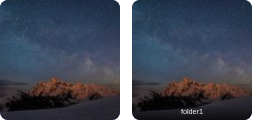

# Favorites

Favorites provide quick access to items you view frequently. Favorited items appear in a dedicated strip at the top of the gallery for one-click access.

	
	
<em>The favorites strip stays available across folders and adds parent-path badges when same-named items would otherwise look identical.</em>

## Adding Favorites

There are several ways to mark an item as a favorite:

### Double-Tap/Double-Click

The quickest method:

- **Mobile**: Double-tap any item thumbnail
- **Desktop**: Double-click any item thumbnail

A brief animation confirms the action.

### Star Icon

Click the star icon on any item:

- **In gallery**: Hover over an item to reveal the star icon in the top-right corner
- **In lightbox**: Click the star icon in the top-left area

### Selection Mode

Add multiple favorites at once:

1. Enter selection mode (long-press on mobile, click checkbox on desktop)
2. Select items to favorite
3. Click the **Favorite** button in the selection toolbar

## Removing Favorites

Use any of the same methods to remove a favorite:

- Double-tap/double-click the item again
- Click the star icon (now shown as filled/highlighted)
- In selection mode, selected favorites can be toggled

## Favorites Strip

When you have favorites, they appear in a horizontal strip below the breadcrumb navigation.

### Features

- Scroll horizontally to see all favorites
- Click any favorite to open it directly
- Favorites reuse the same thumbnail treatment as the main gallery
- The star icon on favorites is always visible
- Same-named items from different folders show a parent-folder badge for clarity

### Reordering Favorites

You can reorder favorites directly in the strip:

- **Desktop**: Drag a favorite left or right to reposition it
- **Touch devices**: Long-press a favorite to lift it into drag mode, then move it
- The new order is saved immediately and reused the next time you open the app

### Visibility

The favorites strip:

- Appears automatically when you have at least one favorite
- Hides automatically when you remove your last favorite
- Persists across folders (favorites from any location are shown)
- Can open media from other folders without forcing you to navigate to that folder first

## Favorites and Folders

You can favorite any item type:

- **Folders**: Favorite frequently accessed folders for quick navigation
- **Images**: Favorite images you view often
- **Videos**: Favorite videos for quick playback
- **Playlists**: Favorite playlists for easy access

## Use Cases

### Quick Access

Favorite items you access daily or weekly, such as:

- Current project folders
- Recent photo albums
- Favorite videos

### Temporary Bookmarks

Use favorites as temporary bookmarks while browsing:

1. Favorite interesting items as you browse
2. Review favorites later
3. Remove favorites after reviewing

### Curated Collections

Create a curated view of your best content:

1. Browse your library
2. Favorite standout items
3. The favorites strip becomes a highlight reel
