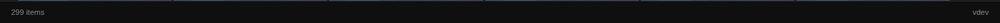
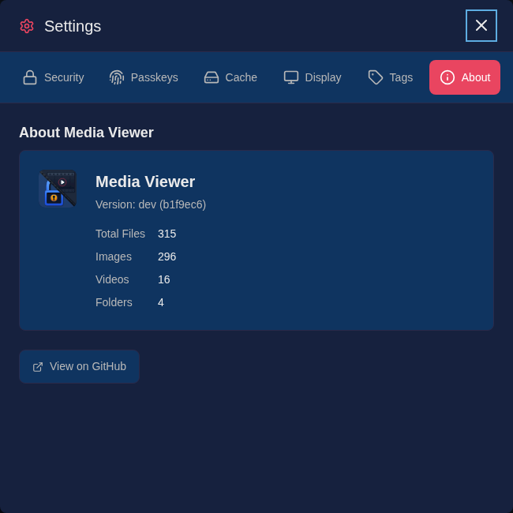

# User Guide Overview

This guide provides comprehensive documentation for the main Media Viewer workflows. Whether you're browsing your collection, organizing with tags and metadata-driven auto-tagging, curating collections, pinning favorites, or managing playlists, you'll find the core interactions here.

## Core Concepts

### Gallery

The gallery is the main interface for browsing your media library. It displays items in a responsive grid that adapts to your screen size. Items can be folders, images, videos, or playlists.

### Lightbox

The lightbox is a full-screen viewer for images and videos. It provides navigation controls, media information, and quick access to tagging and favorites.

### Tags

Tags are labels you assign to media items for organization. An item can have multiple tags, and tags can be searched, filtered, managed in bulk, or imported automatically from embedded file metadata.

### Favorites

Favorites are bookmarked items that appear in a quick-access strip at the top of the gallery. Use favorites for items you access frequently, then reorder them when you want a predictable shortcut strip.

### Collections

Collections are user-created, ordered groups of images and videos. Use them when you want to build a shortlist, album, or review set that you can browse and manage as its own sequence.

### Playlists

Playlists are Windows Media Player (.wpl) files that define an ordered sequence of videos. Media Viewer can read and play these playlist files from your media library.

## Interface Elements

### Header

The header contains:

- **Application title**: Click to return to the root directory
- **Search box**: Find media by name or tag
- **Sort controls**: Change sort field and order
- **Filter dropdown**: Show specific media types
- **Settings**: Open password, passkeys, cache tools, display preferences, tag management, and About information
- **Logout**: End the current session

### Breadcrumb

The breadcrumb shows your current location in the folder hierarchy. Click any segment to navigate to that folder.

### Gallery Grid

The main content area displays media items in a grid. On desktop, items show additional metadata including type, size, and tags.

### Favorites Strip

When you have favorites, they appear in a horizontal scrollable strip below the breadcrumb.

### Stats Bar

The bottom bar displays live library information including total images, videos, folders, favorites, the last indexed time, the running version/build when available, and a compact status summary for the indexer, thumbnails, and auto-tagger.

  
  
<em>The stats bar keeps library counts and background worker state visible while you browse.</em>

## Settings

Access the Settings modal by clicking the gear icon in the header. It provides tabs for managing your password, passkeys, cache tools, display preferences, tags, and library information.

The Cache tab includes a **Background Activity** section with live cards for the indexer, thumbnail generator, auto-tagger, and transcode cache, alongside maintenance actions such as reindexing, thumbnail rebuilds, clearing cached video transcodes, and on-demand auto-tagger runs.

The **About** tab shows the application version and a summary of your library contents, including total files, images, videos, and folders.

  
  
<em>The About tab shows the current application version and a breakdown of your library by media type.</em>

## Guide Sections

- [Browsing Media](browsing.md) - Navigate and view your library
- [Collections](collections.md) - Create, browse, and manage ordered media sets
- [Tagging](tagging.md) - Organize with tags
- [Favorites](favorites.md) - Bookmark items for quick access
- [Playlists](playlists.md) - Play Windows Media Player (.wpl) playlist files
- [Search](search.md) - Find media quickly
- [Keyboard Shortcuts](keyboard-shortcuts.md) - Efficiency shortcuts
