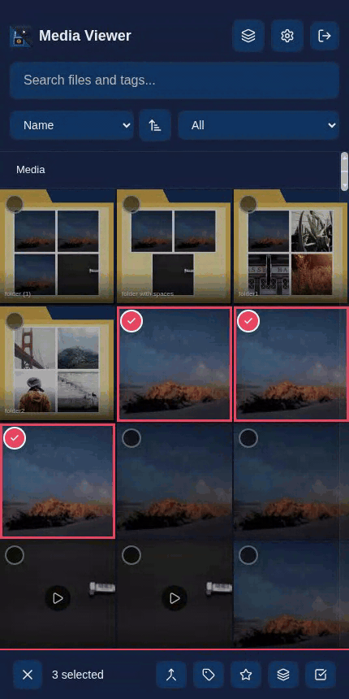
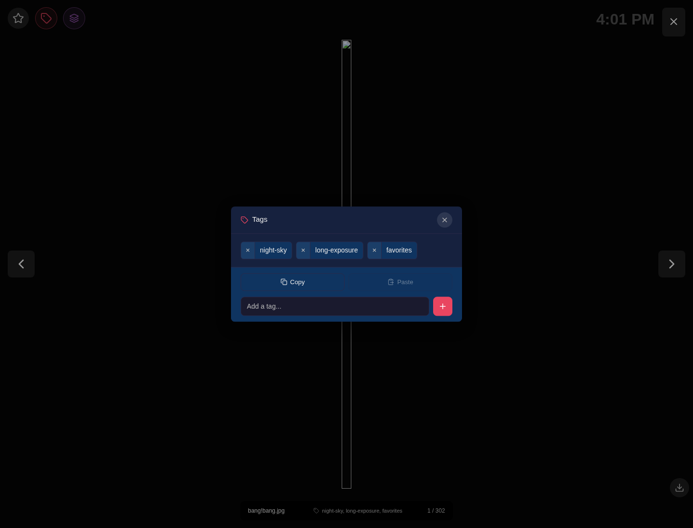
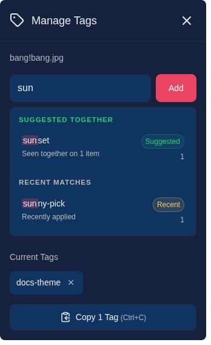
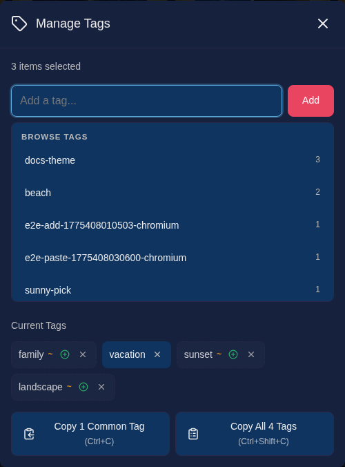
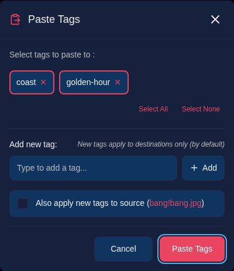
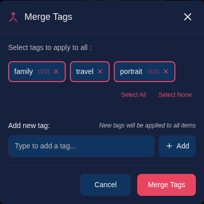
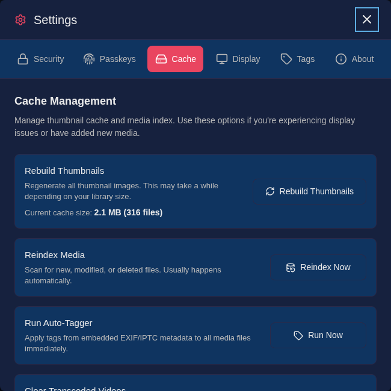
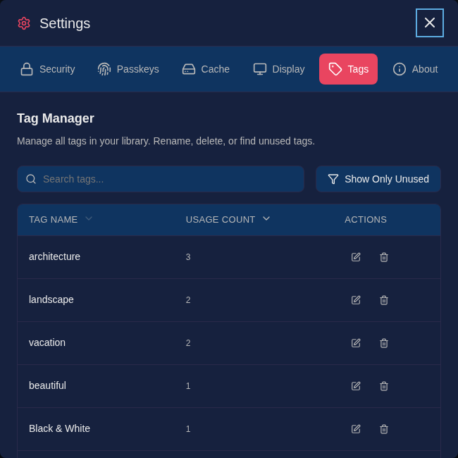

# Tagging

Tags are labels you assign to media items for organization and quick retrieval. Media Viewer provides a flexible tagging system that supports individual and bulk operations.

<div align="center">
  
  <p><em>Selection mode enables efficient bulk tagging on mobile</em></p>
</div>

## Understanding Tags

- Tags are simple text labels (e.g., "vacation", "family", "2024")
- An item can have multiple tags
- Tags are shared across your entire library
- Tags are case-sensitive ("Vacation" and "vacation" are different tags)

## Adding Tags

### From the Gallery

1. Hover over an item to reveal the tag button (tag icon in the top-left corner)
2. Click the tag button to open the tag manager
3. Type a tag name in the input field
4. Press ++enter++ or click **Add**
5. Repeat for additional tags
6. Click outside the modal or press ++escape++ to close

### From the Lightbox

1. Open an item in the lightbox
2. Click the tag icon in the top-left area
3. Add tags using the same process as above

<div align="center">
  
  <p><em>The lightbox drawer keeps tagging close to full-screen review, including copy and paste actions.</em></p>
</div>

### Tag Suggestions

As you type, existing tags that match your input appear as suggestions. Click a suggestion to add that tag, or continue typing to create a new tag.

The tag modal also ranks suggestions to speed up repeat tagging:

- **Recent tags** are remembered in the current browser and shown near the top when they are relevant
- **Suggested tags** highlight tags that are commonly used with the tags already on the current item
- An empty input can still show useful suggestions instead of waiting for you to type
- When you do type, likely follow-up tags stay ahead of generic matches

Depending on context, suggestions may be grouped as **Suggested Next**, **Recent Tags**, **Suggested Together**, **Recent Matches**, or **Other Matches**.

<div align="center">
  
  <p><em>Empty-input suggestions can highlight likely next tags and recently used tags before you start typing.</em></p>
</div>

<div align="center">
  
  <p><em>Typing narrows the list while keeping related tags ahead of general matches.</em></p>
</div>

## Removing Tags

### From the Tag Manager

1. Open the tag manager for an item
2. Click the X on any tag chip to remove it

### From the Gallery (Desktop)

On desktop, tags are displayed on gallery items with a "X | tag" format:

1. Hover over a tag on any gallery item
2. Click the X on the left side of the tag to remove it

### From the Tag Tooltip

When an item has more than 3 tags, a "+N" indicator appears:

1. Click the "+N" indicator to see all tags
2. Click the X on any tag to remove it

## Bulk Tagging

Selection mode allows you to tag multiple items at once.

### Entering Selection Mode

- **Desktop**: Click the checkbox area on any gallery item
- **Mobile**: Long-press any item

### Tagging Selected Items

1. Select the items you want to tag
2. Click the **Tag** button in the selection toolbar
3. Add tags in the bulk tag modal
4. Tags are applied to all selected items

Bulk tagging uses the combined tag set from the current selection to generate follow-up suggestions. Tags already present on the selected items are excluded automatically.

<div align="center">
  
  <p><em>The bulk tag modal shows shared tags, partial tags, and the combined context used for suggestions.</em></p>
</div>

### Tag Indicators in Bulk Mode

When tagging multiple items, the modal shows:

- Tags common to all selected items
- Tags present on some items (marked with a "~" indicator)

## Copying and Pasting Tags

Media Viewer supports copying tags from one item and pasting them to others.

### Copying Tags

1. Enter selection mode
2. Select a single item
3. Click **Copy Tags** or press ++ctrl+c++

### Pasting Tags

1. With tags copied, select destination item(s)
2. Click **Paste Tags** or press ++ctrl+v++
3. In the confirmation modal, select which tags to paste
4. Click **Paste Tags** to apply

<div align="center">
  
  <p><em>Paste previews the copied tag set before it is applied to the current selection.</em></p>
</div>

### Merging Tags

When multiple items are selected, you can merge all their tags:

1. Select 2 or more items
2. Click **Merge Tags** or press ++ctrl+m++
3. The modal shows all unique tags from selected items
4. Tags not on all items show a count (e.g., "nature (2/3)")
5. Select tags to apply and click **Merge Tags**

All selected tags are applied to all selected items.

<div align="center">
  
  <p><em>Merge collects the full tag set across selected items so you can normalize related media in one step.</em></p>
</div>

## Searching by Tag

Click any tag to search for all items with that tag. Alternatively, use the search box with the `tag:` prefix:

```

tag:vacation

```

### Tag Exclusion

Exclude items with specific tags from search results:

```
-tag:private
```

or

```
NOT tag:private
```

**Combining Filters:**

```
tag:vacation -tag:2023
```

Finds items tagged "vacation" but not "2023".

### Search View Tag Behavior

When viewing search results, tag interactions are search-focused:

- **Hover** over any tag to see the exclude button (−)
- **Click** the exclude button to add that tag as an exclusion to your search
- **Right-click** or **long-press** any tag for "Search for" or "Exclude" options
- Clicking tags searches for them rather than opening the tag editor

This behavior helps you refine searches without leaving the results view.

See [Search](search.md) for more search options.

## Auto-Tagging from File Metadata

Media Viewer can automatically apply tags to images and videos based on metadata embedded directly in the files. This is useful for pre-tagging large photo or video libraries before importing, or for workflows where metadata is written by your camera, editor, or DAM software.

### How It Works

When the server indexes your media it also checks the `description` (or `comment`) field of each file for tags. Two formats are recognised:

**Explicit `tags:` marker** — works in any description field, on any file type:

```
tags:<name1>, <name2>, <name3>
```

**Plain keyword list** — works automatically for photos tagged in Lightroom, digiKam, Apple Photos, or any tool that writes IPTC Keywords or XMP Subject. If the description contains a comma-separated list of short values with no sentence punctuation, the values are treated directly as tags — no special encoding required:

```
nature, landscape, golden hour
```

Existing manually-applied tags are never removed; auto-tags are always merged additively.

### Embedding Tags in a File — Explicit Format

Add a `tags:` entry anywhere in the file's description metadata:

```
tags:<name1>, <name2>, <name3>
```

A semicolon can be used to end the list early, which is useful when you want to include additional descriptive text after the tags:

```
tags:<name1>, <name2>, <name3>; rest of your description here
```

**Key points:**

- The `tags:` prefix is **case-insensitive** (`Tags:`, `TAGS:`, and `tags:` all work)
- The **semicolon is optional** — if omitted, the parser reads to the end of the string
- Tag names **may contain spaces** (e.g., `New York`, `black and white`)
- Leading and trailing whitespace in each tag name is trimmed automatically
- Empty entries (two consecutive commas) are ignored

**Examples:**

| Description field                                             | Tags applied                                 |
| ------------------------------------------------------------- | -------------------------------------------- |
| `tags:landscape, nature, 2024`                                | `landscape`, `nature`, `2024`                |
| `tags:landscape, nature, 2024;`                               | `landscape`, `nature`, `2024`                |
| `tags:first tag,second,this is still a tag`                   | `first tag`, `second`, `this is still a tag` |
| `Summer trip. tags: New York, street photography; Leica M10.` | `New York`, `street photography`             |
| `Tags:Black & White, Architecture`                            | `Black & White`, `Architecture`              |

### Auto-Detection of Standard Photo Keywords

Photos exported from Lightroom, digiKam, Apple Photos, or any software that writes **IPTC Keywords** or **XMP Subject** are picked up automatically — no `tags:` prefix needed. When the description field contains a plain comma-separated list of short values with no sentence-ending punctuation (`.`, `!`, `?`), those values are imported as tags directly.

| Description / Keywords field           | Tags applied                               |
| -------------------------------------- | ------------------------------------------ |
| `nature, landscape`                    | `nature`, `landscape`                      |
| `Portrait, Indoor, Street Photography` | `Portrait`, `Indoor`, `Street Photography` |
| `New York, Black & White, Golden Hour` | `New York`, `Black & White`, `Golden Hour` |
| `A beautiful walk in the park. 2024.`  | _(not imported — sentence punctuation)_    |
| `Wow! Great shot, fantastic light`     | _(not imported — exclamation mark)_        |

### Writing Metadata to Files

You can embed the description field using common tools:

- **[ExifTool](https://exiftool.org/)** (images and videos):
    ```bash
    exiftool -Description="tags:landscape, nature, 2024" photo.jpg
    ```
- **[digiKam](https://www.digikam.org/)** — set the Caption/Description field in the metadata panel; IPTC Keywords are picked up automatically
- **Adobe Bridge / Lightroom** — use the Description field in the IPTC or EXIF panel; keywords assigned in Lightroom are also picked up automatically
- **ffmpeg** (videos):
    ```bash
    ffmpeg -i input.mp4 -metadata description="tags:landscape, nature" -c copy output.mp4
    ```

### When Tags Are Applied

Tags are applied:

1. **After each index run** — files changed since the last pass are processed automatically
2. **On a periodic timer** (`EXIF_TAG_INTERVAL`, default `24h`) — ensures all files are eventually processed even if they were not caught by an incremental pass
3. **On demand** — use the **Run Auto-Tagger** button in **Settings → Cache** to trigger an immediate full pass

<div align="center">
  
  <p><em>The Cache tab in Settings lets you trigger an on-demand auto-tagger pass alongside other cache actions.</em></p>
</div>

### Conflict Resolution

- If a tag from the file metadata already exists in the library under a different spelling (e.g., the library has `Nature` and the file has `nature`), the **existing spelling is kept** and no duplicate is created.
- Tags are always **merged additively** — auto-tagging never removes a tag that was added manually.

### Configuration

See [EXIF_TAGGING_ENABLED and EXIF_TAG_INTERVAL](../admin/environment-variables.md#exif_tagging_enabled) in the environment-variables reference to enable/disable or adjust the scan interval.

## Tag Management Tips

- Use consistent naming conventions (e.g., always lowercase)
- Create a hierarchy with prefixes (e.g., "location-beach", "location-mountain")
- Use year tags for chronological organization (e.g., "2024", "2023")
- Combine tags for precise filtering (search for multiple tags)

## Tag Manager

Access the centralized Tag Manager from **Settings** → **Tags** tab to organize and maintain your entire tag library.

<div align="center">
  
  <p><em>The Tag Manager lists every tag in your library with usage counts and quick rename/delete actions.</em></p>
</div>

### Viewing Tags

The Tag Manager displays all tags in your library with:

- **Tag name** with color indicator (if set)
- **Usage count** showing how many files have each tag
- **Sortable columns** by name (alphabetical) or count (most/least used)

### Search and Filter

- **Search bar**: Type to filter tags by name in real-time
- **Show Only Unused**: Filter to see tags that aren't assigned to any files
- **Show All Tags**: Reset filter to view all tags

### Renaming Tags

Rename a tag to fix typos or update naming conventions:

1. Click the **Rename** button next to any tag
2. Enter the new tag name
3. If the new name already exists, tags will be merged
4. The rename affects all files using that tag
5. Case-only changes are supported (e.g., "animal" → "Animal")

**Note:** The affected file count is shown in the confirmation message.

### Deleting Tags

Remove unused or unwanted tags:

1. Click the **Delete** button next to any tag
2. Confirm the deletion in the modal
3. The tag is removed from all files automatically
4. The deletion count shows how many files were affected

### Use Cases

- **Clean up typos**: Rename "vacaton" to "vacation"
- **Standardize naming**: Rename "Beach" to "beach" for consistency
- **Merge duplicates**: Rename "holidays" to "vacation" to combine similar tags
- **Remove clutter**: Delete experimental or one-off tags
- **Find orphans**: Use "Show Only Unused" to identify and remove tags no longer in use
